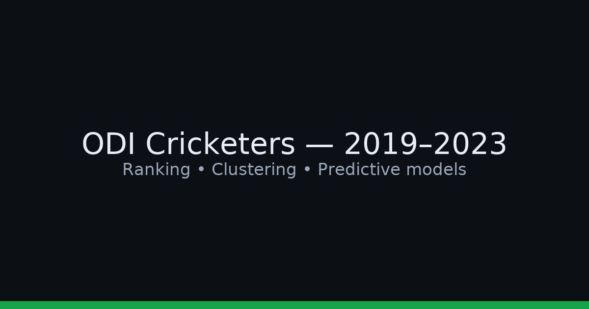

# Statistical Analysis of ODI Cricketers (2019–2023)

End-to-End Analysis of ODI Cricketers (2019–2023)

Comprehensive study of ODI player performance across men’s and women’s cricket using PCA (ranking), clustering (role/skill archetypes), supervised learning (role classification & match-outcome prediction), and MANOVA/ANOVA (country/continent comparisons). Dataset spans 2019–2023 and covers batting, bowling, and fielding metrics.

Clean, reproducible, and recruiter-friendly. R is the primary stack; Python notebooks are optional.

🎯 Objectives

Rank batters, bowlers, and all-rounders using Principal Component Analysis (PCA).

Cluster players into performance archetypes (hierarchical & k-means).

Classify player roles with ML techniques (SVM, Random Forest, Logistic/Multinomial Regression, Naive Bayes, KNN, Neural Nets).

Predict match outcomes (win/loss) and evaluate with ROC/AUC.

Compare performance across continents and within Asia using MANOVA/ANOVA.

Explore associations (e.g., toss → result, batting first → result, home advantage) via odds ratios/contingency analyses.

Auto-indexed from repo:

Scripts
src/Cluster.R, src/Heirarchical Clustering.R, src/Heirarchical Clustering1.R,
src/Hotelling Tsquare.R, src/K Fold Cross Validation.R, src/KNN Prediction.R,
src/Logistic Regression.R, src/MANOVAASIA.R, src/MANOVAMEN.R, src/MANOVAWOMEN.R,
src/MatchResultPrediction.R, src/MenAsiaHeirarchichalClustering.R, src/MenKC.R,
src/MenKMeansClustering.R, src/Multinomial.R, src/Naive Bayes.R, src/Neural Network.R,
src/PCA.R, src/Random Forest Prediction.R, src/SVM.R, src/SVM1.R,
src/SVMPrediction.R, src/wlb.R,
src/Women Classification Techniques.R, src/Women Feature Importance.R,
src/Women K Means Clustering.R, src/WomenAsiaHeirarchichalClustering.R,
src/WomenCluster1.R, src/WomenKmeansClustering.R

Raw data (examples)
data/raw/Asia.csv, data/raw/Aus&NZ.csv, data/raw/Continents.csv, data/raw/Matches.csv,
data/raw/MenbowlerAsia.csv, data/raw/MenCluster.csv, data/raw/MENCRICKETDATA.csv,
data/raw/Mentoss.csv, data/raw/Women Ranking (Batters).csv, data/raw/women12.csv,
data/raw/WomenAsia.csv, data/raw/WomenAsiaBatsmans.csv, data/raw/WomenbatsmanAsia.csv,
data/raw/womenbatting.csv, data/raw/Womenbowling.csv, data/raw/WomenCluster.csv,
data/raw/WomenContinents.csv, data/raw/Womendata.csv

🧠 Methods Overview
Dimensionality reduction / ranking: PCA (loadings, PC scores, biplots).
Unsupervised learning: Hierarchical clustering (Ward/complete link) & k-means (elbow/silhouette).
Supervised learning: SVM, Random Forest, Logistic/Multinomial Regression, Naive Bayes, KNN, Neural Networks.
Inference: MANOVA/ANOVA for continent/Asia comparisons; 2×2 tables & odds ratios for associations.
Evaluation: Accuracy, confusion matrices, ROC/AUC where applicable.

🚀 How to Run
Option A — R (primary)
Open R/RStudio and set working directory to the repo root.
Install packages:
install.packages(c(
  "tidyverse","ggplot2","cluster","factoextra","randomForest",
  "e1071","nnet","class","MASS","pROC"
))

Typical workflow (run as needed):
PCA Rankings → src/PCA.R (saves tables/biplots to reports/figures/)
Clustering (Men/Women) → src/Heirarchical Clustering*.R, src/*KMeans*.R, src/MenKC.R
Role Classification → src/SVM*.R, src/Random Forest Prediction.R,
src/Logistic Regression.R, src/Multinomial.R, src/Naive Bayes.R, src/KNN Prediction.R, src/Neural Network.R
Match Outcome Prediction → src/MatchResultPrediction.R, src/SVMPrediction.R
MANOVA/ANOVA → src/MANOVAMEN.R, src/MANOVAWOMEN.R, src/MANOVAASIA.R
Additional inference → src/Hotelling Tsquare.R, src/wlb.R (if used)

All scripts assume inputs in data/raw/ and will write outputs/plots to reports/figures/ or data/processed/ (gitignored).

Option B — Python (optional notebooks)
python -m venv .venv
# Windows: .\.venv\Scripts\activate
# macOS/Linux: source .venv/bin/activate
pip install pandas numpy scikit-learn matplotlib seaborn jupyter

Open notebooks in notebooks/ and point to data/raw/.

📊 Data & Variables (high level)
Scope: ODI matches from 2019–2023 for both men and women.
Typical batting: innings, runs, balls, average, strike rate, 50/100, 4s/6s, dot%.
Typical bowling: overs, runs, wickets, economy, average, strike rate, 5-wicket hauls, dot%.
Fielding: catches, stumpings.
Match meta: toss, venue/home, result, batting order (first/second), etc.

📈 Outputs
Figures (examples): PCA biplots, dendrograms, k-means clusters, silhouette plots, ROC curves, feature-importance charts.
Tables: Rankings by role, cluster membership, model metrics, MANOVA/ANOVA summaries, contingency/odds ratios.

Save plots to reports/figures/ and reference key images in this README as they’re exported.

🧪 Reproducibility Notes

Keep raw CSVs unchanged in data/raw/.
Generated/cleaned data should go to data/processed/ (gitignored).
Seed your random procedures where relevant for consistent runs.
Scripts are modular; you can run components independently.

🙌 Acknowledgements
Project work credited to the authors and academic mentors (see project report). Thanks to public cricket databases for source data.

📄 License

MIT © Lohith B N
